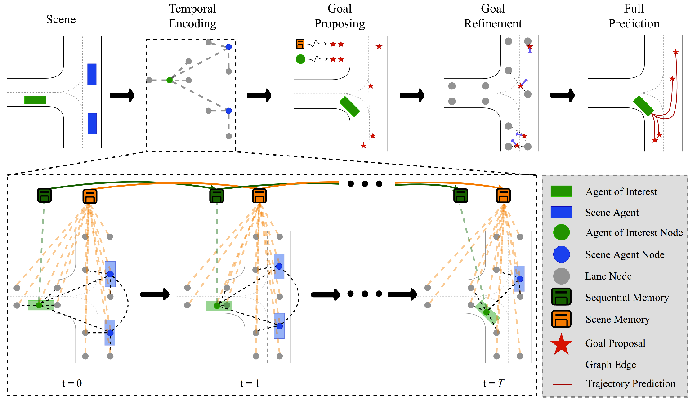

# Trajectory Forecasting on Temporal Graphs
This is the official implementation of the paper *Trajectory Forecasting on Temporal Graphs*.


## Introduction
### [Paper](https://arxiv.org/abs/2207.00255) | [Webpage](https://kuis-ai.github.io/ftgn)

We learn a dynamic scene representation where each timestamp is encoded as a temporal graph. We keep track of changes to the agent of interest with a sequential memory and to the entire scene with a scene memory. We generate goal proposals by using both the scene memory and the motion information related to the agent of interest. Finally, we predict the full trajectories conditioned on the refined goal locations

## Requirements

### 1) Install Argoverse Dataset

Install Argoverse API and Argoverse-Forecasting Dataset by following steps in:
https://github.com/argoai/argoverse-api


### 2) Install Required Packages

Models are trained with Python 3.8 and PyTorch 1.10.0 using CUDA 10.2.

You can install required packages with:
```
pip install -r requirements.txt
```

## Data Preprocessing
For preprocessing (normalization and vectorization), we followed [DenseTNT](https://github.com/Tsinghua-MARS-Lab/DenseTNT). Given
- `$ARGOVERSE_TRAIN_PATH`, path to raw train data,
- `$ARGOVERSE_VAL_PATH`, path to raw validation data,
- `$OUTPUT_PATH`, path to (preprocessed) output data parent directory,

you can create train data as `ex_list`:
```
python utils/preprocess_data.py --data_dir $ARGOVERSE_TRAIN_PATH \
--output_dir $OUTPUT_PATH --core_num 8 \
--agent_of_interest_edges --distance_based_edges --edge_distance_treshold 2.0
```
and validation data as `eval.ex_list`:
```
python utils/preprocess_data.py --data_dir $ARGOVERSE_VAL_PATH \
--output_dir $OUTPUT_PATH --core_num 8 --validation \
--agent_of_interest_edges --distance_based_edges --edge_distance_treshold 2.0
```

## Training
To train the model, given
- `$DATA_PATH`, path to parent directory of preprocessed data in the previous step,
- `$OUTPUT_PATH`, path to save predictions into,
- `$PRETRAINED_VECTORNET_PATH`, path of pretrained naive VectorNet backbone,
- `$MODEL_SAVE_PATH`, path to save data weights into,

You can run the following:
```
python run.py \
--ex_file_path $DATA_PATH/ex_list \
--val_ex_file_path $DATA_PATH/eval.ex_list \
--pretrain_vectornet_path $PRETRAINED_VECTORNET_PATH --pretrained_vectornet \
--output_path $OUTPUT_PATH \
--model_save_path $MODEL_SAVE_PATH --training_name training1 \
--validation_epoch 2 --epoch 36  --world_size 4 \
--learning_rate 0.0001 --time_split_size 2 \
--fuse_time --sequential_encoding --scene_memory \
--data_augmentation --temperature_validation
```

## Validation
To validate the trained model, given
- `$PRETRAINED_PATH`, path to parent directory of weights of trained model,
- `$TRAINED_EPOCH`, number of epochs of past training where weights are saved as `epoch{$TRAINED_EPOCH}.pt` such as epoch35.pt,

You can run the following:
```
python run.py \
--ex_file_path $DATA_PATH/ex_list \
--val_ex_file_path $DATA_PATH/eval.ex_list \
--output_path $OUTPUT_PATH \
--model_save_path $MODEL_SAVE_PATH --training_name validation1 \
--world_size 1 \
--fuse_time --sequential_encoding --scene_memory \
--validate \
--pretrain_path $PRETRAINED_PATH --load_epoch $TRAINED_EPOCH
```

You can download our pretrained model [here](https://github.com/gorkaydemir/FTGN/releases/download/1.0/epoch35.pt)

## How to Cite
```bibtex
@article{aydemir2022ftgn,
        author = {Aydemir, Gorkay and Akan, Adil Kaan and Guney, Fatma},
        title = {Trajectory Forecasting on Temporal Graphs},
        journal={arXiv preprint arXiv:2207.00255},
        year = {2022}}
```

## Acknowledgments
We would like to thank DenseTNT and TGN authors for making their repositories public. This repository contains several code segments from [DenseTNT's repository](https://github.com/Tsinghua-MARS-Lab/DenseTNT) and [TGN's repository](https://github.com/twitter-research/tgn).
